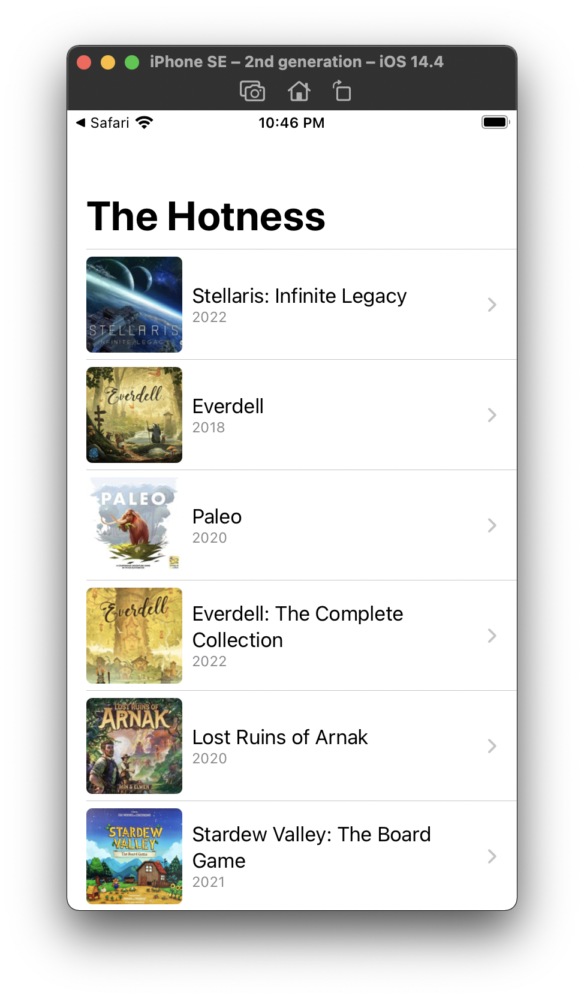
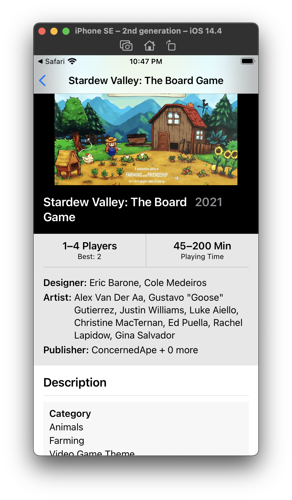

🥕🥕🥕 This is a fork of [pkamppur/mobile-sdk-comparison-2020](https://github.com/pkamppur/mobile-sdk-comparison-2020) with original readme found [here](README-original.md)  🥕🥕🥕

# Elm UI edition

Adding to the declarative UI approach of [these mobile SDKs](https://github.com/pkamppur/mobile-sdk-comparison-2020) with [Elm UI](https://github.com/mdgriffith/elm-ui):

 | 

Pros:
- 👍 It's not CSS
- 👍 There is no App Store or Play Store to deal with

Cons:
- 👎 ... hold on, none

Ok done. Thanks for reading!

## In all seriousness

Similarly to what @pkamppur describes, the promise of a better developer experience, but just on the web, brought me to Elm and pretty soon thereafter to Elm UI. I've somehow managed to avoid writing much frontend web stuff and learning it with increasing demands on my time from tiny fleshy daemons crawling onto my shoulders there is no light at the end of that particular tunnel, for the time being.

What https://elm-lang.org describes Elm having—"No runtime exceptions", "Fearless refactoring", "Understand anyone's code", "Fast and friendly feedback" (from the compiler)—is the general gist but what entices me in my surroundings is to have a concise collection of tools and concepts to wrangle something up to the web for customers to use (and keep using with no runtime errors, see "Fearless refactoring"), whilst working in a small team with sprawling demands, no less.

What Elm UI gives oneself is likewise a concise collection of elements (among others, _row_, _column_, _width fill_, _height shrink_, and in desperate times, a _moveLeft (px 2)_) to describe your UI in. The declaration of how an element should look is right there in the function call, not spookily actioning upon your element from a distant CSS file. The model-view-update loop of Elm, or [TEA](https://guide.elm-lang.org/architecture/index.html), will take care of the rest, where its _Promise_ (if you will in JS territory) is not a wriggly toad thrown into your lap which will either produce a diamond, or a poisonous turd which both might end up on the floor if your mind slips in the slime, but that toad is neatly placed in a box, atop another box, atop... where they all croak at you only when the runtime lets them and neither the diamond will cut your hand nor the turd poison you.

## Ok, in all seriousness

I'm talking about the _update_ method of Elm, where we handle the end-result of each _message_ we sent out to the runtime. 

Upon navigating to the root, we tell in _init_ for the runtime to perform a
```elm
getGames : Cmd Msg
getGames =
    Http.get
        { url = baseUrl ++ "/the-hotness"
        , expect = Http.expectJson (RemoteData.fromResult >> GotGames) decodeHotness
        }
```

Should it all succeed in the network, the _GotGames_ constructor function will be called with a _RemoteData_, which is

```elm
type RemoteData e a
    = NotAsked
    | Loading
    | Failure e
    | Success a
```

With Elm you can easily model your application around these rich types instead of having a null, empty list, an error of some type perhaps all in one dynamic variable which you try to not trip over.

With that RemoteData having been placed into our model in _update_, _view_ is called and from there we case over the RemoteData in _gameListView_, where the UI starts to take form

```elm
    case wlg of
        Success games ->
            container (List.indexedMap (\i -> \g -> gameCell g (i == List.length games - 1) m.detailPushed) games)

        Failure e ->
            container [ el [] (text "Failure") ]

        Loading ->
            container [ el [] (text "Loading") ]

        NotAsked ->
            container [ el [] (text "Kissat koiria sflsfalöfsakflö") ]
```

And produce a list view, where each gameCell is

```elm
gameCell : Game -> Bool -> Element Msg
gameCell g isLast =
    let
        cellH =
            46

        dividerH =
            1

        contentH =
            cellH - dividerH * 2

        dividerTop =
            row [ width fill, height (px 1), BG.color (rgba 0 0 0 0.2) ] []

        dividerBottom =
            if isLast then
                row [ width fill, height (px 1), BG.color (rgba 0 0 0 0.2) ] []

            else
                Element.none
    in
    wrappedRow [ width fill, height (pt cellH), Events.onMouseUp (TappedGame g) ]
        [ column [ width fill, height (pt cellH) ]
            [ row [ width fill, height (px dividerH) ]
                [ dividerTop ]
            , row [ width fill, height (pt contentH) ]
                [ column [ width (fillPortion 2), height (pt contentH), Font.center, clip ]
                    [ image [ centerX, centerY, width (pt <| contentH - 4), height (pt <| contentH - 4), moveLeft 3, moveDown 2, Border.width 0, Border.rounded (siz 4), clip ]
                        { src = g.thumbnailUrl, description = "Logo of " ++ g.name } ]
                , column [ width (fillPortion 5), height (pt contentH) ]
                    [ el [ centerY ] <|
                        column [ paddingXY 10 0 ]
                            [ row (fontWithSize 9 ++ [ Font.alignLeft, width shrink, height shrink ])
                                [ paragraph [] [ text g.name ] ]
                            , row (fontWithSize 6 ++ [ Font.alignLeft, Font.color <| rgba 0 0 0 0.4, width shrink, height shrink, paddingEach { top = 2, left = 0, bottom = 0, right = 0 } ])
                                [ text g.yearPublished ]
                            ]
                    ]
                , column [ width (fillPortion 1), height (pt contentH) ]
                    [ text "" ]
                ]
            , row [ width fill, height (pt contentH) ]
                [ dividerBottom ]
            ]
        ]
```

#### A sidenote

For people lucky to have been familiarized with endless brackets with Objective-C the expressions inside expressions (`(())`) might not cause that much dizziness, but you can use the pipe operators `|>` and `<|` to make the code flow more nicely. Borrowing an example from _Practical Elm for a busy developer_, by Alex Korban (https://korban.net/elm/book/):

```elm
text 
    <| toString 
    <| List.filter canAddUsers 
    <| getActiveUsers projectId users
```
vs.
```elm
users 
    |> getActiveUsers projectId 
    |> List.filter canAddUsers
    |> toString
    |> text
```

where the first example is equivalent to _this_...
```elm
(text (toString (List.filter canAddUsers (getActiveUsers projectId users))))
```

#### Continuing on

Touch-upping on a `gameCell` gets us to `TappedGame g` message, details fethed and the subsequent call to `detailPage`, where I cheated and used a very usable 0.2 version of https://github.com/passiomatic/elm-designer, which resembles something out of Xcode's Interface Builder innards and produces elm-ui code. If feeling like your brain could use a rest, wire the frames of the UI out with it and hash out the details later.

#### Escaping into CSS

What a sharp-eyed code reader might notice is the `htmlImg url maxw maxh = ...` function. I couldn't find a way to scale the image as I needed with elm-ui, so I had to escape into CSS, which is straightforward.  

#### Tooling

How is this all set up?

- download the installer from https://guide.elm-lang.org/install/elm.html
- initialize the project while in `mobile-sdk-comparison-2020/Elm`
```shell
elm init
```

- install elm-ui, remotedata and other packages:
```shell
for pkg in elm/url elm/json elm/http mdgriffith/elm-ui krisajenkins/remotedata NoRedInk/elm-json-decode-pipeline; do elm install $pkg; done
```

- install a helpful local development server with hot reloading and time traveling debugger:
```
npm install -g elm-live
```

- run the thing and navigate to http://localhost:8000:
```shell
elm-live -- src/Main.elm --debug
```

All available packages for Elm are found at https://package.elm-lang.org or a catalogued collection through here https://korban.net/elm/catalog/

Elm plugins are available for VSCode and IntelliJ IDEA among others and `elm-format`, available also via npm, will keep your code neat and uniform with the One True Style as `go fmt` does with Golang sources.

## In conclusion

Have kids? Try Elm UI.

Elm has a superb Slack community discoverable through https://elm-lang.org/community. I don't think a question on #beginners has gone unanswered without great care while I've been there. Also check out #elm-ui obviously and #misc for general software development discussions.

Links:

- Elm Radio episode on Elm UI: https://elm-radio.com/episode/elm-ui/
- a collection of patterns: https://korban.net/elm/elm-ui-patterns/ 